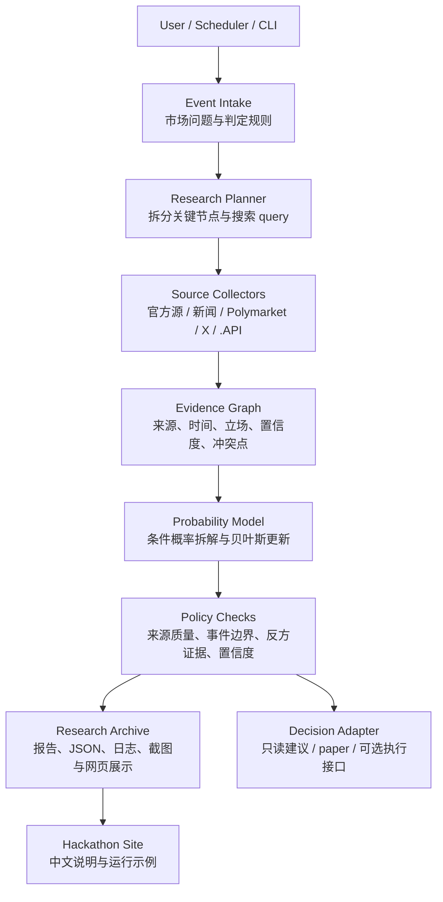

# Forecasting Agent Poly

Forecasting Agent Poly 是一个面向预测市场的自主预测 Agent。它把市场规则、新闻、官方公告、X 上的一线叙事和可扩展 `.API` 信息源转化为可审计的概率研究，并把每次判断的证据、假设、推理路径和输出结论保存下来，方便复核和归档。

项目网页：[https://hackathon-site-murex.vercel.app](https://hackathon-site-murex.vercel.app)

代码仓库：[https://github.com/Alchemist-X/Forecasting-Agent-Poly](https://github.com/Alchemist-X/Forecasting-Agent-Poly)

## 一句话设计

`事件问题 -> 研究规划 -> 多源证据收集 -> 证据图谱 -> 概率建模 -> 规则约束 -> 研究归档 -> 网页展示`

项目的核心不是只输出一个 Yes/No 数字，而是让 Agent 像研究员一样回答：

- 这个 Polymarket 事件到底如何判定？
- 哪些证据支持事件发生，哪些证据反对？
- 每条证据来自哪里、什么时候出现、可信度如何？
- 新证据为什么会上调或下调概率？
- Agent 的概率判断和市场定价之间有什么差异？
- 结论是否足够可靠，还是应该标记为需要人工复核？

## 为什么需要预测 Agent

预测市场的难点不只是计算概率，而是持续理解信息流。一个事件的结果往往同时受市场条款、官方说法、新闻节奏、社交叙事、政策信号和突发事件影响。人工可以判断得很深，但很难 7x24 小时同时跟踪大量事件，也很难在短时间内把判断过程完整写成可复核材料。

Forecasting Agent Poly 的设计目标是把这个过程工程化：

1. **覆盖面**：Agent 可以同时监听多个候选市场和信息源。
2. **时效性**：新信息出现后，系统可以重新整理证据并更新概率。
3. **可解释性**：每个概率变化都要能追溯到具体证据。
4. **可扩展性**：信息源、模型提供方和执行方式都可以替换。
5. **可归档性**：每次研究都会留下结构化产物，而不是黑箱建议。

## 系统总览



这套架构采用 `Market Pulse -> Decision Runtime -> Risk / Policy -> Archive / UI` 分层，并在黑客松展示里聚焦为“预测研究 Agent”：先讲清楚概率是怎么来的，再决定是否进入后续动作。

## 核心模块设计

### 1. Event Intake：明确事件定义

预测市场问题经常有模糊边界。例如“是否达成协议”“谁能代表某一方”“截止日期如何计算”“市场的 resolution source 是什么”。Agent 进入研究前会先把自然语言问题拆成可判定条件：

- 事件文本和市场链接
- 判定截止时间
- 官方 resolution rule
- 关键实体和可替代说法
- 可能导致争议的边界条件

这一步的目标是避免后续模型研究了一个和市场规则不一致的问题。

### 2. Research Planner：拆分关键节点

Agent 不直接搜索一个泛泛的问题，而是把事件拆成多个研究节点，并为每个节点生成 query。

以“美国和伊朗是否在某日期前达成核协议”为例，系统会拆成：

- 什么算“达成协议”
- 是否存在公开谈判进展
- 双方关键人物是否释放积极或消极信号
- 官方机构是否发布书面承诺或否认
- 军事、制裁、国内政治是否降低协议概率
- 市场条款采用哪个来源作为最终裁定

### 3. Source Collectors：可扩展的信息源

Forecasting Agent Poly 的信息源不是写死的单一 API，而是可扩展的 source layer。

当前设计关注这些来源：

- **Polymarket**：市场标题、规则、价格、评论区和 resolution 信息。
- **官方源**：政府公告、机构声明、法院/监管文件、项目方公告。
- **新闻源**：主流媒体、专业媒体和地区媒体。
- **X**：实时叙事、记者/KOL 更新、当事人表态和二级传播。
- **`.API` / xapito**：用于帮助 Agent 接入 X 和更多开放信息源，把实时叙事转成结构化证据节点。

xapito 在这里的价值不是“替 Agent 做结论”，而是把原本散落在 X 和开放网络里的实时信息变成 Agent 可以引用、打分、比对和归档的证据。

### 4. Evidence Graph：证据图谱与研究归档

Agent 会把收集到的信息整理成证据节点。每个节点至少包含：

| 字段 | 说明 |
| --- | --- |
| `source` | 来源类型与链接 |
| `timestamp` | 信息发布时间或抓取时间 |
| `claim` | 这条信息声称了什么 |
| `stance` | 支持、反对或中性 |
| `weight` | 依据来源质量、时效性和相关性得到的权重 |
| `confidence` | Agent 对这条证据可靠性的判断 |
| `conflicts` | 与哪些证据冲突 |

这样做的好处是：评委或团队成员不需要相信模型本身，只需要检查“证据是否真实、权重是否合理、推理是否连贯”。

### 5. Probability Model：结构化概率推理

系统会把复杂事件拆成条件概率，而不是直接拍一个数字。

示例：

```text
P(Yes) = P(A) x P(B | A) x P(C | A and B)

A = 双方继续维持有效谈判
B = 文本中包含市场认可的关键条款
C = 截止日前出现可被 resolution source 认可的公开确认
```

当新证据出现时，Agent 会说明它影响的是哪一个节点：

- 官方声明支持谈判继续，主要上调 `P(A)`。
- 军事升级或制裁信号增强，可能下调 `P(A)` 或 `P(B | A)`。
- 可信记者披露草案细节，可能上调 `P(B | A)`。
- 市场规则要求更严格的公开确认，则会限制 `P(C | A and B)`。

### 6. Policy Checks：不要让输出变成黑箱建议

在输出结论前，系统会做规则检查：

- 事件定义是否清楚
- 是否引用了足够多的独立来源
- 是否记录了反方证据
- 是否存在来源互相冲突
- 是否把市场规则和现实事件混淆
- 概率变化是否能追溯到证据
- 是否应该标记为“需要人工复核”

这层约束让 Agent 的输出更像一份研究档案，而不是一句“我觉得会发生”。

### 7. Decision Adapter：研究输出如何被使用

Forecasting Agent Poly 支持多种使用方式：

- **只读研究**：输出概率、证据链和市场定价对比，不触发任何执行动作。
- **paper 模式**：用于测试决策流程和归档结构。
- **可选执行接口**：当使用者显式配置环境、通过 preflight，并确认风险后，系统可以把研究结果交给执行层。

黑客松展示默认强调前两种：可复核预测研究和完整归档。

## 代码结构

| 路径 | 作用 |
| --- | --- |
| `apps/hackathon-site` | 黑客松中文官网，展示项目定位、能力、流程、运行示例和 Future Plans |
| `apps/web` | 更完整的运行结果展示与管理界面 |
| `services/orchestrator` | 研究输入、候选市场处理、概率决策、规则检查、报告产物 |
| `services/executor` | Polymarket 连接、订单接口、执行层风控和状态同步 |
| `packages/contracts` | 跨模块共享 schema 和类型契约 |
| `packages/db` | 数据库 schema、查询接口、本地 state fallback |
| `packages/terminal-ui` | 终端输出、进度、错误摘要和表格展示 |
| `scripts` | 工作区级入口脚本，把研究、推荐、测试和执行流程串起来 |
| `runtime-artifacts` | 本地运行归档目录，保存报告、JSON、summary、checkpoint 和错误信息 |
| `docs` | 架构图、运行说明、视频脚本和补充文档 |

## 主要运行路径

### Research / Recommendation

```bash
pnpm pulse:recommend
```

用于生成只读研究和候选建议。适合演示、调试和人工复核。

### Paper Flow

```bash
pnpm trial:recommend
pnpm trial:approve
```

用于验证研究、决策和归档流程，不依赖真实执行。

### Hackathon Site

```bash
pnpm --filter @autopoly/hackathon-site dev
pnpm --filter @autopoly/hackathon-site build
pnpm --filter @autopoly/hackathon-site typecheck
```

官网是本次黑客松的正式项目网页，部署在 Vercel：

```text
https://hackathon-site-murex.vercel.app
```

### Live Path 注意

仓库里存在 live 相关入口，例如 `pnpm daily:pulse` 和 `pnpm pulse:live`。这些路径需要真实环境变量、preflight 和明确授权。黑客松 README 不把它们作为默认演示入口；如果只是展示项目，请优先使用只读研究或 paper 流程。

## 产物与归档

一次完整研究通常会留下这些材料：

- 市场问题与判定规则
- source list：新闻、官方公告、Polymarket、X、`.API`
- 证据图谱：支持、反对、中性、冲突点
- 概率拆解：基线概率、条件概率、更新路径
- 规则检查：是否缺来源、是否需要人工复核
- 最终输出：Agent 概率、市场定价、差异说明
- 网页展示：适合评委和团队成员快速理解

## 模型与 Provider

系统不绑定单一模型框架。当前设计允许通过 runtime provider 接入不同 Agent：

```bash
AGENT_RUNTIME_PROVIDER=codex
AGENT_RUNTIME_PROVIDER=claude-code
AGENT_RUNTIME_PROVIDER=openclaw
```

Provider 只负责生成或协助推理；证据结构、规则检查、归档格式和执行约束尽量保持在工程层，避免把安全性和可复核性完全交给 prompt。

## 黑客松提交材料

4 分钟视频脚本：

```text
docs/hackathon-submission-video-script.md
```

正式项目网页：

```text
https://hackathon-site-murex.vercel.app
```

## 开发命令

安装依赖：

```bash
pnpm install
```

全仓构建：

```bash
pnpm build
```

全仓类型检查：

```bash
pnpm typecheck
```

官网本地开发：

```bash
pnpm --filter @autopoly/hackathon-site dev
```

## 设计原则

1. **先证据，后概率**：没有证据链的概率不应被展示为强结论。
2. **先规则，后事件**：预测必须和市场 resolution rule 对齐。
3. **先归档，后展示**：所有关键判断都要留下可复核材料。
4. **先只读，后执行**：研究链路和执行链路分层，默认演示不需要真实执行。
5. **可替换组件**：信息源、模型 provider、网页展示和执行方式都可以替换。
